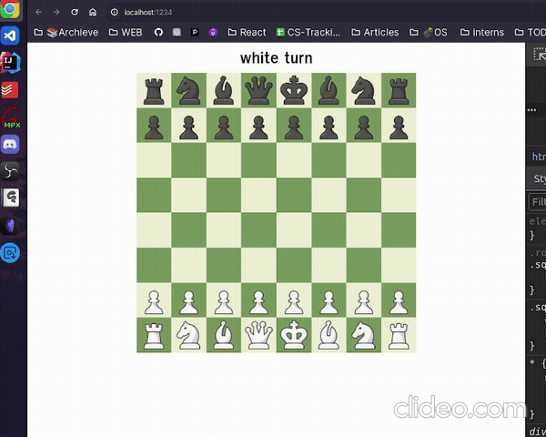
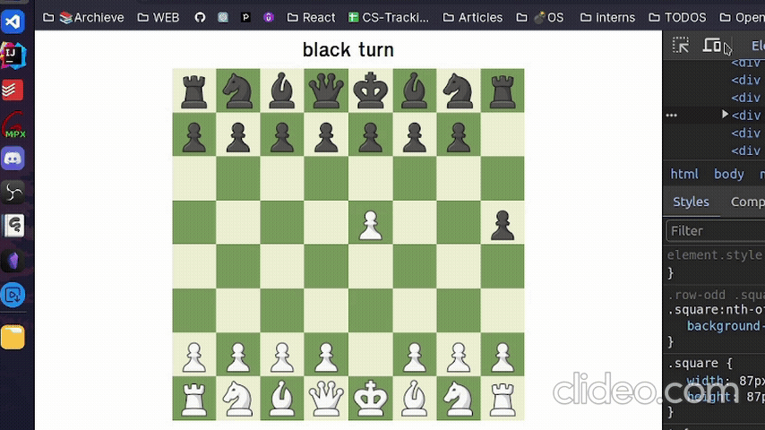
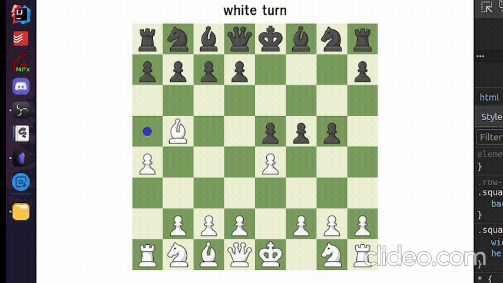

# Chess Game

This is a clone of the [Chess.com](https://www.chess.com/home) using JavaScript.

Try It: https://chess-game-93c2.vercel.app/

## Table Of Contents 📖

- [Overview 🎯](#overview-)
  - [Demo 🖼️](#Demo-️)
    - [Capturing Piece](#capturing-piece)
    - [En Passent](#en-passent)
    - [King Checked](#king-checked)
  - [Links 📌](#links-)
- [Your Process 📝](#your-process-)
  - [Built with 🛠️](#built-with-️)
  - [What you Learned 🗒️](#what-you-learned-️)
- [Author 👨🏻‍💻](#author-)

## Overview 🎯

In this project, I've designed and implemented a chess game that includes:

- Correct available moves for each piece
- `Promote Pawn` rule
- `En Passent` rule
- `Castling` between king and rook
- Blocking King Moves to cells under attack
- Checkmate

### Demo 🖼️

#### Capturing Piece

#### En Passent

#### King Checked

## Your Process 📝

1. Understood Chess Rules:
   [Chess Video](https://www.youtube.com/watch?v=ej_fnsdsksA&t=516s&pp=ygULY2hlc3MgcnVsZXM%3D)
2. Collected assets from [Chess.com](https://www.chess.com/home) website
3. Implemented markup
4. Implemented pieces moves logic using OOP (Specifically Inheritance and
   Polymorphism)
5. Implemented board which is the controller of the project
6. Connected all components together

### Built with 🛠️

- HTML, CSS
- JavaScript
  - Object-Oriented Programming (OOP)
  - Modules
- Model-View-Controller Architecture (MVC)

### What you Learned 🗒️

- Managing shared state among multiple functions that modify it
- Planning large projects

## Author 👨🏻‍💻

Thank you for visiting! Check out my other projects:

- [Forkify Recipe App](https://github.com/ahmad-kashkoush/Forkify-v2)
- [Mapty Exercise Tracker](https://github.com/ahmad-kashkoush/Mapty-Project)
- [Ask.fm Clone](https://github.com/ahmad-kashkoush/Ask-Me)
